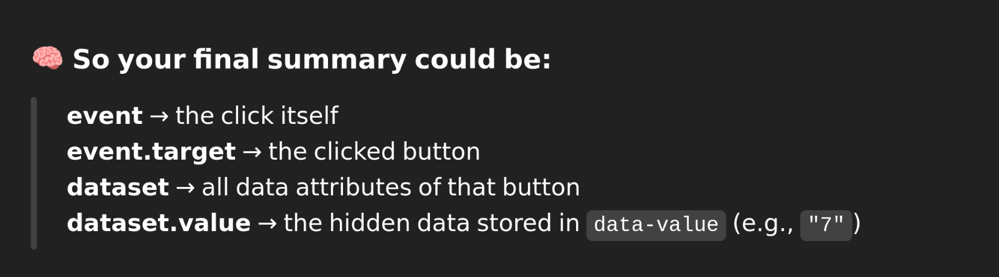
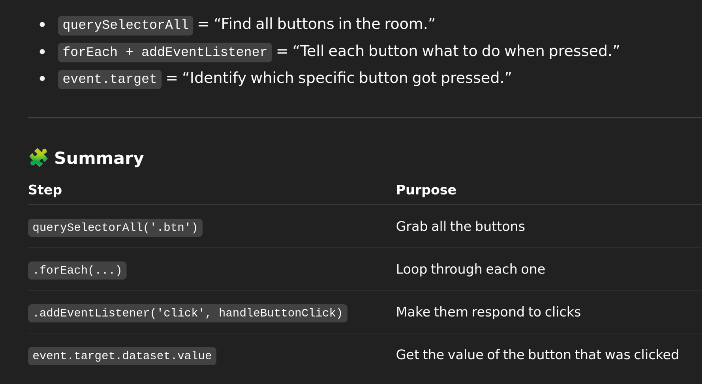

event.target = the HTML element that was clicked.
.dataset = all the data-* attributes on that element.
.dataset.value = the value of the attribute data-value.

Three pillars of js
Types
Scope/Closure
This/ Prototypes

null => Type of Object
undefined => Type of Undefined

NaN => Type of Number
Type of array => Object

Expression => part of a statement eg   comparison expression, variable expression
 eg var age = 39; // age = 39; is an expression
Statement => complete line of code
eg var age = 39; // complete line of code

Types:
Primitive TYpes: booleand, strings, number ,object, symbol, undefined, 
converting types
checking equality

Primitive TYpes: booleand, strings, number ,object, symbol, undefined, 

Non-primitive: null,function,arrays
type is assigned to values themselves , not variables

undefined=> undeclared variable, unassigned variable.

var v = null;
typeof v;// object ... js historical bug
typeof array =>object

string/divsion => Nan //special value that indicates we had a invalid numerical operation